# A Deep Dive into Database Tables for BOB

<div class="absolute bottom-0 left-0 w-full px-10 py-8 grid grid-cols-2 justify-items-stretch items-end gap-4">
  <div class="text-left">
    <small><time datetime="2024-04-12">6 May 2024</time></small>
  </div>
</div>


<style>
  a {
    border-bottom: none !important;
  }
</style>

<!--
Hi everyone!
-->

---
layout: image-right
image: /images/5222215177628405026_121.jpg
class: annotated-list
---

# Structure of talk

1. Introduction
2. Lifecycle Creation Domain
3. Submission Domain
5. Entity Relationship Diagram
6. Conclusion
<!--
slide notes
-->
---
layout: cover
---

# <span v-mark.circle.orange>Introduction</span>

<!--
speaker notes
-->

---
class: annotated-list
---
# Introduction
<div class="text-xl mt-10">

  BOB consists of two core domains
  - Lifecycle Creation
  - Submission
</div>
<!--
- lets first walk through a high level overview of the tables involved and how they are connected
- note: Am skipping Supporting models like Invites / User sessions etc to simplify
- following slides we shall show the models we are focused on for the first part
- through this talk we will look at the database as-is for the value
-->

---
layout: image
image: images/image-1.png
backgroundSize: full
---

---
layout: image
image: images/Screenshot 2024-05-05 at 12.06.12 PM.png
backgroundSize: full
---

---
class: annotated-list
layout: image-right
image: images/image-10.png
backgroundSize: contain
---

# Lifecycle versions

```sql {all}
create table lifecycle_versions
(
    id           bigserial
        primary key,
    lifecycle_id bigint            not null
        constraint fk_rails_29ab38ff52
            references lifecycles,
    version      integer default 1 not null,
    created_at   timestamp(6)      not null,
    updated_at   timestamp(6)      not null,
    published_at timestamp(6)
);
```
---


# Lifecycle configuration UI


---
layout: image-right
image: images/image-12.png
backgroundSize: contain
---

# Form

```sql {all}{class:'!children:text-l'}

create table forms
(
    id                   bigserial
        primary key,
    lifecycle_version_id bigint
        constraint fk_rails_e634ef928b
            references lifecycle_versions,
    name                 text,
    code                 text         not null,
    parent_form_id       integer
        constraint fk_rails_e653280767
            references forms,
    config               jsonb default '{}'::jsonb,
    reference_id_code    text  default ''::text
);
```

- the 'code' attribute references the form type

---

# Form permissions
- given by the template
- given to form roles, read/write/transit at a state
```sql {all}{class:'!children:text-l'}
create table form_permissions
(
    id           bigserial
        primary key,
    form_id      bigint       not null
        constraint fk_rails_da745ea6aa
            references forms,
    state_id     bigint
        constraint fk_rails_873090a1a9
            references states,
    form_role_id bigint       not null
        constraint fk_rails_b107edc885
            references form_roles,
    permission   text         not null
);
```

---
layout: image-right
image: images/image-13.png
---

# Component
   skipping the created_at and updated_at from here on

```sql {all}{class:'!children:text-l'}
create table components
(
    id                     bigserial
        primary key,
    form_id                bigint
        constraint fk_rails_ef2123a26e
            references forms,
    reference_id           text                 not null,
    type                   text,
    data                   jsonb,
    logic                  jsonb,
    "order"                text,
    reference_component_id bigint
        constraint fk_rails_e63e1d2c27
            references components,
    deletable              boolean default true not null
);
```

the logic part is specifically for the component type 'ConditionalField'

---
layout: image-right
image: images/image-14.png
class: annotated-list
backgroundSize: contain

---
# Component model to UI mapping


---

# Component permission
  Component permissions are the same as Form permissions but on a component level.
  They are dynamically assigned through the UI


<!--
  when we scroll down on the component ui
  what we get here maps to the following tables
-->
---

# State

```sql {all}{class:'!children:text-l'}
create table states
(
    id                      bigserial
        primary key,
    form_id                 bigint
        constraint fk_rails_45b00c2dd1
            references forms,
    code                    text,
    applicant_display_name  text,
    backoffice_display_name text
);
```
<!--
they are created within the template and referenced by edges to form part of the workflow
-->
---

# Edges

```sql {all}{class:'!children:text-l'}
create table edges
(
    id                   bigserial
        primary key,
    origin_state_id      bigint
        constraint fk_rails_06cad8ac7b
            references states,
    destination_state_id bigint
        constraint fk_rails_f794660934
            references states,
    action_name          text,
    priority             text,
    config               jsonb
);
```
<!--
  determines how the states connect to each other
  think arrows / connecting paths
  also configured in the template
-->

---

# Workflow


  

<!--
now that we have state and edges, we can see them in the workflow diagram below, we are missing roles which will be covered
  there is a role in each state responsible for transiting the state in the workflow (transit permission)
-->

---
layout: image-right
image: images/image-15.png
---
# Logic


this is form logic which stores logic conditions and actions associated with forms

an example logic seen in the db:

```
{"expression": "project_end_date < project_start_date", "reference_ids": ["project_start_date", "project_end_date"]}
```

---

# Roles Model

- The Role model serves as a central point for defining all the roles available in the system.
- Both backoffice user roles and form roles are derived from the roles defined in the Role model.

Access controlled is mapped to various roles through three models

<!--
for specifying different level (which we have covered)
1. form_permissions
2. component_permissions
3. lifecycle_permissions

can think of as roles are assigned permissions
-->

---

# Roles Model

  - FormRole: maps the roles available to a form (both backoffice use roles and form roles)
  - BackofficeUserRole: Represents BO roles **assigned** to backoffice users

<!--
BO user role is a overall role wn the lc, FormRole is for specific form within a lifecycle
-->

---

# Form Roles

- These roles determine the permissions and access control for a particular form.

```sql {all}{class:'!children:text-l'}
create table form_roles
(
    id         bigserial
        primary key,
    form_id    bigint       not null
        constraint fk_rails_8cbe42f886
            references forms,
    role_id    bigint       not null
        constraint fk_rails_0e35556d66
            references roles,
);
```

---

# Submission Domain
- Submission
  - Represents the main entity for storing submitted data.
- SubmissionInput
  - Stores the input values provided by users for each component in a submission.
- SubmissionState
  - Represents the current state of a submission within a lifecycle.

---
layout: image-right
image: images/image-20.png
backgroundSize: contain
---
# Submission Domain
 Back office
  - Back office user
  - Back office user roles
  - Actor: **Associates Backoffice::User to a Form Role** 

---
layout: image-right
image: /image-21.png
backgroundSize: contain
---

# Submission Domain
 Front office
  - Applicant User
  - Applicant User Companies

<!--
applicant users
. I.e. Users who create and submit applications, their access and permissions are determined by the LC configuration
: Represents the association between applicant users and companies
-->
---
layout: image-right
image: images/image-19.png
backgroundSize: contain
---
# Submission

```sql {all}{class:'!children:text-l'}
create table submissions
(
    id                   bigserial
        primary key,
    form_id              bigint
        constraint fk_rails_6575b196ef
            references forms,
    reference_id         text,
    submitted_at         timestamp(6),
    actor_id             bigint
        constraint fk_rails_89b07fe3f3
            references actors,
    metadata             jsonb,
    submitter_type       text,
    submitter_id         bigint,
    parent_submission_id bigint
        constraint fk_rails_dd342e46cb
            references submissions
);
```

---

# Submission Input

- SubmissionInputs are created for each component in the form, they store the input values of applicant users
<div class="grid grid-cols-2 grid-rows-2 gap-2">

```sql {all}{class:'!children:text-l'}
create table submission_inputs
(
    id            bigserial
        primary key,
    submission_id bigint
        constraint fk_rails_103830b69b
            references submissions,
    component_id  bigint
        constraint fk_rails_1b37b11947
            references components,
    value         jsonb default '{}'::jsonb not null,
    type          text
);
```
<div>

```
  value:                     , type
  {""data"": ""2024-03-21""}", DateFieldInput 
```

</div>
</div>

---

# Submission State
- Is seen on the grant dashboard, saves the state of a submission


```sql {all}{class:'!children:text-l'}
create table submission_states
(
    submission_id bigint                not null,
    state_id      bigint                not null
        constraint fk_rails_dd362d42d4
            references states,
    is_transient  boolean default false not null,
    edge_id       bigint
        constraint fk_rails_6ff15525ab
            references edges
);
```
---

# Backoffice User Roles

- Represent the roles that can be assigned to backoffice users.
- These roles determine the overall permissions and access levels of backoffice users within the system.
- Our Techpass users, currently only the 'system admin' role
- The BackofficeUserRole model associates these roles with the Backoffice::User model.

```sql {all}{class:'!children:text-l'}
create table backoffice_user_roles
(
    id                 bigserial
        primary key,
    role_code          text         not null,
    backoffice_user_id bigint
        constraint fk_rails_0479ec7d74
            references backoffice_users
);
```

---

# Entity Relationship diagram 

    (get code from the markdown)

```mermaid
erDiagram
    ACTORS {
        bigint id
        datetime created_at
        datetime updated_at
        bigint role_id
        jsonb metadata
        bigint backoffice_user_id
    }
    
    APPLICANT_USERS {
        bigint id
        text identifier
        text type
        text name
        text session_id
        datetime created_at
        datetime updated_at
    }
    
    APPLICANT_USERS_COMPANIES {
        bigint id
        bigint applicant_user_id
        bigint company_id
        datetime created_at
        datetime updated_at
    }
    
    BACKOFFICE_USERS {
        bigint id
        text name
        text identifier
        text type
        datetime created_at
        datetime updated_at
        text session_id
    }
    
    BACKOFFICE_USER_ROLES {
        bigint id
        text role_code
        bigint backoffice_user_id
        datetime created_at
        datetime updated_at
    }
    
    COMPANIES {
        bigint id
        text uen
        jsonb edh_company_data
        datetime last_edh_updated_at
        datetime created_at
        datetime updated_at
    }
    
    COMPONENT_CHILDREN {
        bigint id
        bigint parent_component_id
        bigint child_component_id
        datetime created_at
        datetime updated_at
    }
    
    COMPONENT_PERMISSION_TEMPLATES {
        bigint id
        bigint form_id
        text name
        datetime created_at
        datetime updated_at
    }
    
    COMPONENT_PERMISSION_TEMPLATE_ITEMS {
        bigint id
        bigint component_permission_template_id
        bigint state_id
        bigint form_role_id
        text permission
        datetime created_at
        datetime updated_at
    }
    
    COMPONENT_PERMISSIONS {
        bigint id
        bigint component_id
        text permission
        datetime created_at
        datetime updated_at
        bigint state_id
        bigint form_role_id
    }
    
    COMPONENTS {
        bigint id
        bigint form_id
        text reference_id
        text type
        jsonb data
        datetime created_at
        datetime updated_at
        jsonb logic
        text order
        bigint reference_component_id
        boolean deletable
    }
    
    EDGES {
        bigint id
        bigint origin_state_id
        bigint destination_state_id
        datetime created_at
        datetime updated_at
        text action_name
        text priority
        jsonb config
    }
    
    EMAIL_TEMPLATES {
        bigint id
        bigint lifecycle_version_id
        jsonb data
        datetime created_at
        datetime updated_at
    }
    
    FORM_PERMISSIONS {
        bigint id
        bigint form_id
        bigint state_id
        bigint form_role_id
        text permission
        datetime created_at
        datetime updated_at
    }
    
    FORM_PRECONDITIONS {
        bigint id
        bigint form_id
        string name
        string operation
        string group
        string type
        jsonb config
        string failure_message
        string hint
        datetime created_at
        datetime updated_at
    }
    
    FORM_ROLES {
        bigint id
        bigint form_id
        bigint role_id
        datetime created_at
        datetime updated_at
    }
    
    FORMS {
        bigint id
        bigint lifecycle_version_id
        text name
        datetime created_at
        datetime updated_at
        text code
        integer parent_form_id
        jsonb config
        text reference_id_code
    }
    
    HISTORIES {
        bigint id
        json data
        text historyable_type
        bigint historyable_id
        text triggerer_type
        bigint triggerer_id
        datetime created_at
        datetime updated_at
        text action_type
    }
    
    INVITES {
        bigint id
        bigint lifecycle_id
        bigint submission_id
        string submitter_type
        bigint submitter_id
        text name
        text email
        datetime sent_at
        jsonb email_template_values
        jsonb submission_prefill_values
        datetime created_at
        datetime updated_at
    }
    
    LIFECYCLE_PERMISSIONS {
        bigint id
        bigint backoffice_user_id
        bigint lifecycle_id
        datetime created_at
        datetime updated_at
        text permission
    }
    
    LIFECYCLE_VERSIONS {
        bigint id
        bigint lifecycle_id
        integer version
        datetime created_at
        datetime updated_at
        datetime published_at
    }
    
    LIFECYCLES {
        bigint id
        datetime created_at
        datetime updated_at
        datetime start_at
        datetime end_at
        text template_code
        jsonb data
        text name
    }
    
    LOGICS {
        bigint id
        bigint form_id
        text name
        jsonb conditions
        text action
        text target_reference_ids
        datetime created_at
        datetime updated_at
        jsonb action_data
    }
    
    ROLES {
        bigint id
        text name
        datetime created_at
        datetime updated_at
        bigint lifecycle_id
    }
    
    SECTORS {
        bigint id
        text code
        text display_name
        datetime created_at
        datetime updated_at
    }
    
    STATES {
        bigint id
        bigint form_id
        text code
        datetime created_at
        datetime updated_at
        text applicant_display_name
        text backoffice_display_name
    }
    
    SUB_SECTORS {
        bigint id
        text code
        text display_name
        bigint sector_id
        datetime created_at
        datetime updated_at
    }
    
    SUBMISSION_INPUTS {
        bigint id
        bigint submission_id
        bigint component_id
        jsonb value
        datetime created_at
        datetime updated_at
        text type
    }
    
    SUBMISSION_INPUT_CHILDREN {
        bigint id
        bigint parent_submission_input_id
        bigint child_submission_input_id
        text group
        datetime created_at
        datetime updated_at
    }
    
    SUBMISSION_STATES {
        bigint id
        bigint submission_id
        bigint state_id
        boolean is_transient
        datetime created_at
        datetime updated_at
        bigint edge_id
    }
    
    SUBMISSIONS {
        bigint id
        bigint form_id
        text reference_id
        datetime created_at
        datetime updated_at
        datetime submitted_at
        bigint actor_id
        jsonb metadata
        text submitter_type
        bigint submitter_id
        bigint parent_submission_id
    }
    
    WEBHOOK_SUBSCRIBERS {
        bigint id
        string subscribable_type
        bigint subscribable_id
        text event
        text url
        datetime created_at
        datetime updated_at
    }
    
    ACTORS }o--|| BACKOFFICE_USERS : "belongs to"
    ACTORS }o--|| ROLES : "belongs to"
    
    APPLICANT_USERS_COMPANIES }o--|| APPLICANT_USERS : "belongs to"
    APPLICANT_USERS_COMPANIES }o--|| COMPANIES : "belongs to"
    
    BACKOFFICE_USER_ROLES }o--|| BACKOFFICE_USERS : "belongs to"
    
    COMPONENT_CHILDREN }o--|| COMPONENTS : "belongs to (as parent)"
    COMPONENT_CHILDREN }o--|| COMPONENTS : "belongs to (as child)"
    
    COMPONENT_PERMISSION_TEMPLATE_ITEMS }o--|| COMPONENT_PERMISSION_TEMPLATES : "belongs to"
    COMPONENT_PERMISSION_TEMPLATE_ITEMS }o--|| STATES : "belongs to"
    COMPONENT_PERMISSION_TEMPLATE_ITEMS }o--|| FORM_ROLES : "belongs to"
    
    COMPONENT_PERMISSION_TEMPLATES }o--|| FORMS : "belongs to"
    
    COMPONENT_PERMISSIONS }o--|| COMPONENTS : "belongs to"
    COMPONENT_PERMISSIONS }o--|| STATES : "belongs to"
    COMPONENT_PERMISSIONS }o--|| FORM_ROLES : "belongs to"
    
    COMPONENTS }o--|| FORMS : "belongs to"
    COMPONENTS }o--|| COMPONENTS : "belongs to (as reference)"
    
    EDGES }o--|| STATES : "belongs to (as origin)"
    EDGES }o--|| STATES : "belongs to (as destination)"
    
    EMAIL_TEMPLATES }o--|| LIFECYCLE_VERSIONS : "belongs to"
    
    FORM_PERMISSIONS }o--|| FORMS : "belongs to"
    FORM_PERMISSIONS }o--|| STATES : "belongs to"
    FORM_PERMISSIONS }o--|| FORM_ROLES : "belongs to"
    
    FORM_PRECONDITIONS }o--|| FORMS : "belongs to"
    
    FORM_ROLES }o--|| FORMS : "belongs to"
    FORM_ROLES }o--|| ROLES : "belongs to"
    
    FORMS }o--|| LIFECYCLE_VERSIONS : "belongs to"
    FORMS }o--|| FORMS : "belongs to (as parent)"
    
    INVITES }o--|| LIFECYCLES : "belongs to"
    INVITES }o--|| SUBMISSIONS : "belongs to"
    
    LIFECYCLE_PERMISSIONS }o--|| BACKOFFICE_USERS : "belongs to"
    LIFECYCLE_PERMISSIONS }o--|| LIFECYCLES : "belongs to"
    
    LIFECYCLE_VERSIONS }o--|| LIFECYCLES : "belongs to"
    
    LOGICS }o--|| FORMS : "belongs to"
    
    ROLES }o--|| LIFECYCLES : "belongs to"
    
    STATES }o--|| FORMS : "belongs to"
    
    SUB_SECTORS }o--|| SECTORS : "belongs to"
    
    SUBMISSION_INPUTS }o--|| SUBMISSIONS : "belongs to"
    SUBMISSION_INPUTS }o--|| COMPONENTS : "belongs to"
    
    SUBMISSION_INPUT_CHILDREN }o--|| SUBMISSION_INPUTS : "belongs to (as parent)"
    SUBMISSION_INPUT_CHILDREN }o--|| SUBMISSION_INPUTS : "belongs to (as child)"
    
    SUBMISSION_STATES }o--|| SUBMISSIONS : "belongs to"
    SUBMISSION_STATES }o--|| STATES : "belongs to"
    SUBMISSION_STATES }o--|| EDGES : "belongs to"
    
    SUBMISSIONS }o--|| FORMS : "belongs to"
    SUBMISSIONS }o--|| ACTORS : "belongs to"
    SUBMISSIONS }o--|| SUBMISSIONS : "belongs to (as parent)"
```



---

# Thank You!