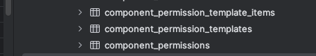

# Deep dive into the database tables for grant workflow platform

---

# Agenda

1. Introduction
2. Lifecycle Creation Domain
3. Submission Domain
5. Entity Relationship Diagram
6. Conclusion

---

# Introduction

- BOB consists of two core domains:
  - Lifecycle Creation
  - Submission
- Let's dive into the tables and their relationships
- lets first walk through a high level overview of the tables involved and how they are connected
- note: Am skipping Supporting models like Invites / User sessions etc to simplify

---

# Lifecycle Creation Domain


---

# Lifecycle Creation Domain


---

# Lifecycle Creation Domain

  models related to Lifecycle Creation Domain
- Lifecycles : Main entity for creating and managing Lifecycles
   - Lifecycle versions: Stores different versions of a lifecycle
   - Lifecycle Permissions: Defines access permissions for lifecycles based on backoffice users

- Forms: Represents the forms used within a lifecycle
  - Components: Stores the components that make up a form
   - Component Permissions
  - Logics: Stores logic conditions and actions associated with forms

---

# Lifecycle Creation Domain

- States: Represents the different states a submission can be in
- Roles: Represents the roles in a lifecycle, and are used to define permissions and access control within the LC
- Edges: Represents the transitions between states. It belongs to State (as origin and destination)

---

# Lifecycle tables: Lifecycle


```sql {all}{class:'!children:text-l'}
create table lifecycles
(
    id            bigserial
        primary key,
    created_at    timestamp(6)              not null,
    updated_at    timestamp(6)              not null,
    start_at      timestamp(6),
    end_at        timestamp(6),
    template_code text,
    data          jsonb default '{}'::jsonb not null,
    name          text
);

```


---

# Lifecycle


the most important attribute is 'template_code' which comes from the linear_template we are familiar with. 


---

# Lifecycle


the most important attribute is 'template_code' which comes from the linear_template we are familiar with. 


---
layout: image-right
image: /image-4.png
class: annotated-list
backgroundSize: full
---

# Lifecycle permissions
Defines the permissions for lifecycles based on backoffice users

```sql {all}{class:'!children:text-l'}
create table lifecycle_permissions
(
    id                 bigserial
        primary key,
    backoffice_user_id bigint
        constraint fk_rails_e2a11070c4
            references backoffice_users,
    lifecycle_id       bigint
        constraint fk_rails_555f5ae601
            references lifecycles,
    created_at         timestamp(6) not null,
    updated_at         timestamp(6) not null,
    permission         text
);
```


--- 

# Lifecycle versions

```sql {all}{class:'!children:text-l'}
create table lifecycle_versions
(
    id           bigserial
        primary key,
    lifecycle_id bigint            not null
        constraint fk_rails_29ab38ff52
            references lifecycles,
    version      integer default 1 not null,
    created_at   timestamp(6)      not null,
    updated_at   timestamp(6)      not null,
    published_at timestamp(6)
);
```


---

# Lifecycle configuration UI


---
layout: image-right
image: /image-12.png
backgroundSize: contain
---

# Form

```sql {all}{class:'!children:text-l'}

create table forms
(
    id                   bigserial
        primary key,
    lifecycle_version_id bigint
        constraint fk_rails_e634ef928b
            references lifecycle_versions,
    name                 text,
    code                 text         not null,
    parent_form_id       integer
        constraint fk_rails_e653280767
            references forms,
    config               jsonb default '{}'::jsonb,
    reference_id_code    text  default ''::text
);
```

- the code attribute tells us the form type

---

# Form permissions
- given by the template
- given to form roles, read/write/transit at a state
```sql {all}{class:'!children:text-l'}
create table form_permissions
(
    id           bigserial
        primary key,
    form_id      bigint       not null
        constraint fk_rails_da745ea6aa
            references forms,
    state_id     bigint
        constraint fk_rails_873090a1a9
            references states,
    form_role_id bigint       not null
        constraint fk_rails_b107edc885
            references form_roles,
    permission   text         not null
);
```

---
layout: image-right
image: /image-13.png
---

# Component
   skipping the created_at and updated_at from here on

```sql {all}{class:'!children:text-l'}
create table components
(
    id                     bigserial
        primary key,
    form_id                bigint
        constraint fk_rails_ef2123a26e
            references forms,
    reference_id           text                 not null,
    type                   text,
    data                   jsonb,
    logic                  jsonb,
    "order"                text,
    reference_component_id bigint
        constraint fk_rails_e63e1d2c27
            references components,
    deletable              boolean default true not null
);
```

the logic part is specifically for the component type 'ConditionalField'

---
layout: image-right
image: /image-14.png
class: annotated-list
backgroundSize: contain

---
# Component model to UI mapping


---

# Component permission
  Component permissions are the same as Form permissions but on a component level
  dynamically assigned through the UI
  when we scroll down on the component ui
  what we get here maps to the following tables



---

# State
  they are created within the template and referenced by edges to form part of the workflow

```sql {all}{class:'!children:text-l'}
create table states
(
    id                      bigserial
        primary key,
    form_id                 bigint
        constraint fk_rails_45b00c2dd1
            references forms,
    code                    text,
    applicant_display_name  text,
    backoffice_display_name text
);
```

---

# Edges
  determines how the states connect to each other
  think arrows / connecting paths
  also configured in the template

```sql {all}{class:'!children:text-l'}
create table edges
(
    id                   bigserial
        primary key,
    origin_state_id      bigint
        constraint fk_rails_06cad8ac7b
            references states,
    destination_state_id bigint
        constraint fk_rails_f794660934
            references states,
    action_name          text,
    priority             text,
    config               jsonb
);
```

---

# Workflow
  now that we have state and edges, we can see them in the workflow diagram below, we are missing roles which will be covered
  there is a role in each state responsible for transiting the state in the workflow (transit permission)

  

---
layout: image-right
image: /image-15.png
---
# Logic


this is form logic which stores logic conditions and actions associated with forms

an example logic seen in the db:

```
{"expression": "project_end_date < project_start_date", "reference_ids": ["project_start_date", "project_end_date"]}
```

---

# Roles Model

- The Role model serves as a central point for defining all the roles available in the system.
- It is associated with the Lifecycle model, indicating that roles are defined within the context of a lifecycle.
- Both backoffice user roles and form roles are derived from the roles defined in the Role model.
- The Role model acts as a master list of roles that can be assigned to users and associated with forms.

Access controlled is mapped to various roles through three models specifically for different levels of permission: (we have covered)
1. form_permissions
2. component_permissions
3. lifecycle_permissions


---

# Roles Model

  - FormRole: maps the roles available to a form (both backoffice use roles and form roles)
  - Roles are assigned permissions
  - BackofficeUserRole: Represents BO roles **assigned** to backoffice users (currently filtered in the FE by Corppas user), used to determine the overall permissions and access level of a backoffice user within the system. role_code specifies the specific role that a backoffice user has e.g. 'system_admin'
  - **TLDR**: BO user role is a overall role, FormRole is for specific form within a lifecycle

---

# Form Roles

- Form roles define the roles that are available for users within a specific form in a lifecycle.
- These roles determine the permissions and access control for a particular form.
- Examples of form roles could include "applicant", "reviewer", "approver", etc.
- The FormRole model associates these roles with a specific Form and Role.
- The table associates role ids with form ids (recap: permissions related to these form roles are mapped in 'form_permissions')

```sql {all}{class:'!children:text-l'}
create table form_roles
(
    id         bigserial
        primary key,
    form_id    bigint       not null
        constraint fk_rails_8cbe42f886
            references forms,
    role_id    bigint       not null
        constraint fk_rails_0e35556d66
            references roles,
);
```

---

# Submission Domain
- Submission: Represents the main entity for storing submitted data.
- SubmissionInput: Stores the input values provided by users for each component in a submission. It belongs to Submission and Component and has associations with SubmissionInputChild (for parent-child relationships).
- SubmissionState: Represents the current state of a submission within a lifecycle. It belongs to Submission, Edge, and State.

---
layout: image-right
image: /image-20.png
backgroundSize: contain
---
# Submission Domain
### Back office
  - Backoffice::User: It has associations with LifecyclePermission, BackofficeUserRole, and Actor.
    - does not directly associate users with roles (actual association is handled through the Actors model)
  - Back office user roles: Represents the roles assigned to backoffice userss
  - Actor: **Establishes the association between a Backoffice::User and a Form Role.** They are the decision makers that pass the submission through states

---
layout: image-right
image: /image-21.png
backgroundSize: contain
---

# Submission Domain
### Front office
  - Applicant::User: Represents applicant users in the system. I.e. Users who create and submit applications, their access and permissions are determined by the LC configuration
  - applicant_user_companies: Represents the association between applicant users and companies

---
layout: image-right
image: /image-19.png
backgroundSize: contain
---
# Submission

- It has associations with Form, Actor, SubmissionInput, SubmissionState, and Invite (skipped for now)
```sql {all}{class:'!children:text-l'}
create table submissions
(
    id                   bigserial
        primary key,
    form_id              bigint
        constraint fk_rails_6575b196ef
            references forms,
    reference_id         text,
    submitted_at         timestamp(6),
    actor_id             bigint
        constraint fk_rails_89b07fe3f3
            references actors,
    metadata             jsonb,
    submitter_type       text,
    submitter_id         bigint,
    parent_submission_id bigint
        constraint fk_rails_dd342e46cb
            references submissions
);
```
---

# Submission Input

- SubmissionInputs are created for each component in the form, they store the input values of applicant users
<div class="grid grid-cols-2 grid-rows-2 gap-2">

```sql {all}{class:'!children:text-l'}
create table submission_inputs
(
    id            bigserial
        primary key,
    submission_id bigint
        constraint fk_rails_103830b69b
            references submissions,
    component_id  bigint
        constraint fk_rails_1b37b11947
            references components,
    value         jsonb default '{}'::jsonb not null,
    type          text
);
```
<div>

```
  value:                     , type
  {""data"": ""2024-03-21""}", DateFieldInput 
```

</div>
</div>

---

# Submission State
- Is seen on the grant dashboard, saves the state of a submission


```sql {all}{class:'!children:text-l'}
create table submission_states
(
    submission_id bigint                not null,
    state_id      bigint                not null
        constraint fk_rails_dd362d42d4
            references states,
    is_transient  boolean default false not null,
    edge_id       bigint
        constraint fk_rails_6ff15525ab
            references edges
);
```
---

# Backoffice User Roles

- Represent the roles that can be assigned to backoffice users.
- These roles determine the overall permissions and access levels of backoffice users within the system.
- Examples of backoffice user roles could include "system_admin", "lifecycle_manager", "submission_reviewer", etc.
- Our Techpass users
- The BackofficeUserRole model associates these roles with the Backoffice::User model.

```sql {all}{class:'!children:text-l'}
create table backoffice_user_roles
(
    id                 bigserial
        primary key,
    role_code          text         not null,
    backoffice_user_id bigint
        constraint fk_rails_0479ec7d74
            references backoffice_users
);
```

---

# Usage of Tables (Back and Front office)
- Backoffice users interact with these tables for reviewing, approving, and managing submissions, while applicants interact with them during the application submission process.
- Other tables, such as lifecycles, lifecycle_versions, forms, components, states, and edges, are primarily used in the lifecycle creation process and are managed by backoffice users with appropriate permissions.

- The tables related to the **submission** process, such as submissions, submission_inputs, submission_states, and invites, are used by both backoffice users and applicants. 

- This differentiation is primarily based on the user roles and their interactions with the system.
Actual access and permissions are controlled through the models, controllers and authorization mechanism in the application.


---

# Conclusion and QnA

- The grant workflow platform's database structure is divided into two main domains
  - Lifecycle Creation domain focuses on the structure and configuration of lifecycles
  - Submission domain deals with the actual data submitted by users and manages submissions
